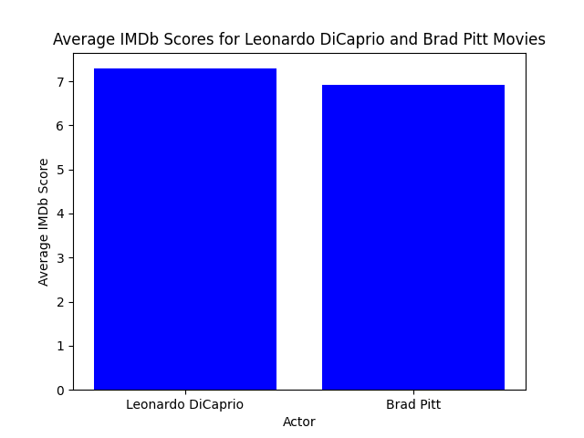
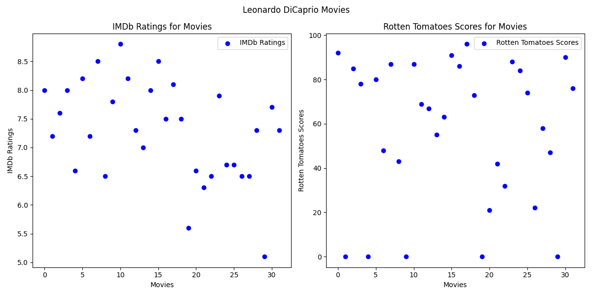
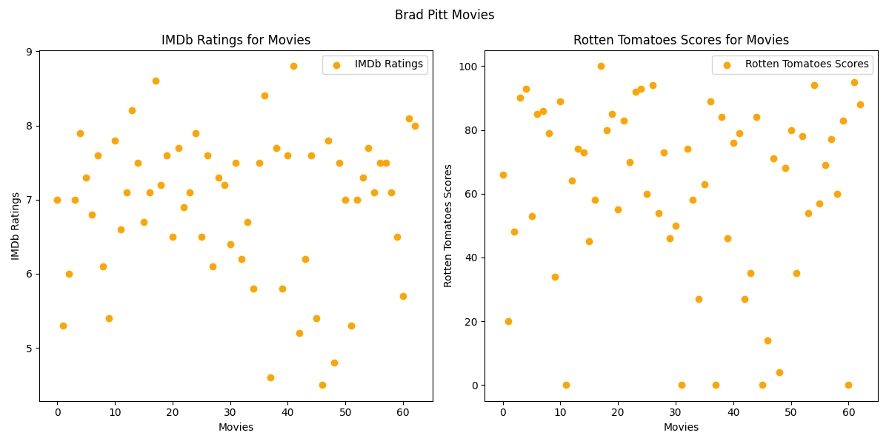

### Purpose and Background:

The purpose of this analysis is to answer the question; Which actor performing in a starring role, between Brad Pitt or Leonardo DiCaprio, leads to higher IMDb and Rotten Tomato ratings on average? Brad Pitt and Leonardo DiCaprio are two of the most famous and well respected actors and have been since the 1990's. They have both been nominated for numerous Oscars and have each won at least one and are well known for their ability to take on diverse roles in films. With all these accolades, many have debated who is the better actor between the two. Although that debate is a matter of opinion, this analysis will dive into the hard facts of which actor has starred in higher rated films. To do so we will use IMDb and Rotten Tomatoes rating data. These two popular businesses are online movie rating databases where critics and fans can give ratings of any film.

### Data Collection:

For this analysis I utilized IMDb and Rotten Tomatoes data available by scraping and querying the OMDb API which can be found at [www.omdbapi.com](http://www.omdbapi.com/). To refine my focus, I filtered through the data and found the IMDb ratings and Rotten Tomatoes scores for every movie Leonardo DiCaprio and Brad Pitt starred in. It is important to note that Brad Pitt has starred in more movies (64) than Leonardo DiCaprio (33) which impacts our analysis as he has more ratings and scores to effect his average.

### Results:

The bar graph below displays the average IMDb ratings for every movie the two actor's have starred in. IMDb ratings are on a 1-10 scale. The analysis shows that, on average, that the film's Leonardo DiCaprio starred in had the slightly better average (7.27) compared to those where Brad Pitt was featured with an average rating of (6.86). 

Our second bar graph below displays the average Rotten Tomatoes ratings for every movie the two actor's have starred in. Rotten Tomatoes scores are on a 0-100 scale. The analysis shows that, on average, the films Leonardo DiCaprio played a role in had a slightly worse average (56.78) compared to those of Brad Pitt (60.97).

Lastly, the scatter plots below show the IMDb ratings and Rotten Tomatoes scores for each film the actors have featured in. As displayed below, we can see that Brad Pitt has starred in more films (64) than Leonardo DiCaprio (33).

### Limitations:

While our study provides valuable insights, it is essential to acknowledge its limitations. Bias from different user demographics on IMDb and Rotten Tomatoes, external influences, and the subjective nature of movie ratings may contribute to variations in our findings. Movie preferences are inherently subjective, and individual tastes can greatly influence ratings.

### Conclusion:

In conclusion, our analysis sought to determine whether Brad Pitt or Leonardo DiCaprio, as lead actors, had higher average ratings on IMDb and Rotten Tomatoes. While the results indicate that Leonardo DiCaprio's movies had a slightly higher average IMDb rating, Brad Pitt's movies obtained a slightly higher average Rotten Tomatoes score.

Despite the aforementioned limitations, our analysis provides a starting point for understanding how these acclaimed actors' movies are received by audiences and critics alike. Moving forward, a more nuanced exploration of viewer demographics, directorial influences, and genre-specific considerations could enhance the depth and accuracy of our understanding.

In the realm of film appreciation, the debate between Brad Pitt and Leonardo DiCaprio's performances will likely persist, as personal preferences and opinions remain integral to the cinematic experience.

### *See data.py for Python Code*
